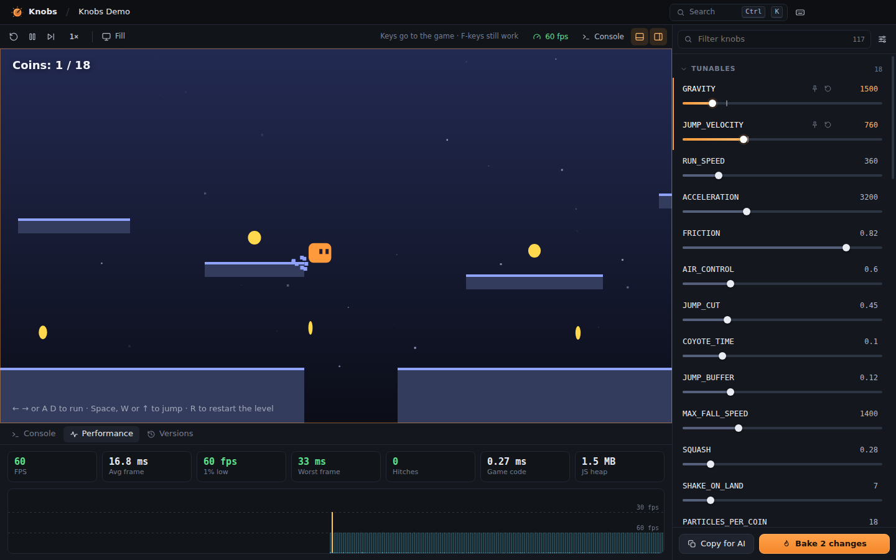

# Knobs

**Tune your HTML games while they run.**

Knobs is a desktop app for people who build browser games, especially with AI chat or artifacts. Paste or open a game and every number and color in its code becomes a live slider. Drag `GRAVITY` or `JUMP_VELOCITY` and the game changes instantly, without a reload and without spending another prompt. When it feels right, *bake* the values back into the file, or copy them as a message so your AI keeps them in the next version.

It runs fully offline. No account, no API keys, no telemetry.



## What it does

- **Live knobs.** Knobs finds named constants (`const GRAVITY = 0.5`), config objects (`CONFIG.player.jump`), class fields and constructor values (`this.speed = 5`), and the numbers inside your functions (`vy += 0.35`). It also finds colors (`'#ff9a3c'`, `rgb()`, `hsl()`) and CSS custom properties. Changes apply live wherever possible. When a value is only read at startup, Knobs restarts the game for you when you let go of the slider.
- **Bake.** `Ctrl S` writes tuned values back into your source files in their original notation. Hex stays hex; negative numbers get parentheses when needed. The previous version is saved first.
- **Copy for AI.** Copies a short message listing the tuned values and where they live, so the next version your AI writes keeps them.
- **Time control.** Pause (`F6`), step one frame (`F7`) and slow motion (`F8`) for any game driven by `requestAnimationFrame`, including audio. These keys work even while the game has keyboard focus.
- **Error reports.** Uncaught errors, rejected promises, failed resource loads and `console.*` output are collected with the exact source line and surrounding code. **Copy for AI** turns any error into a ready-to-paste bug report.
- **Performance.** Live FPS, 1% lows, worst frame, hitches, time spent in your game code per frame, and JS heap, plus a frame-time graph.
- **Versions.** Every time the code changes (you save, paste a new version, bake or restore), Knobs keeps a copy. You can see what changed, play any old version with your current tweaks, or restore it.
- **Hot reload.** Save the file in your editor, or let Claude Code or another agent write it, and the game reloads with your tweaks re-applied.
- **Paste to play.** `Ctrl V` with HTML on the clipboard saves it to `Documents\Knobs\<title>\index.html` and opens it. Pasting a new version of the game that's already open updates it in place, with Undo.

## Install (Windows)

1. Download the latest build from the repository's **Releases** page, or from the **Actions** tab: open the latest *Knobs* run and download the `knobs-Windows` artifact.
2. Run `Knobs-Setup-x.y.z.exe`. It installs per-user and doesn't need admin. Or unzip `Knobs-x.y.z-win-x64.zip` anywhere and run `Knobs.exe`.
3. The app isn't code-signed, so Windows SmartScreen may say *"Windows protected your PC"*. Click **More info → Run anyway**.

Linux builds are published as an AppImage. macOS can be built from source.

## Quick start

1. Open Knobs and click **Try the demo**, or paste the code of any single-file HTML game with `Ctrl V`.
2. Play with keyboard focus in the game, then drag knobs in the right-hand panel.
3. Press `Ctrl S` to bake the values you like into the file, or **Copy for AI** to tell your AI about them.

For best results with AI-generated games, ask for *"all tuning values as named constants or a CONFIG object at the top of the script"*. Named values get the best labels and always update live.

## Keyboard

| Key | Action |
| --- | --- |
| `F5` / `F6` / `F7` | Restart / pause-resume / step one frame |
| `F8`, `Shift F8` | Slower / faster (0.1× – 2×) |
| `F11` | Focus mode: just the game, fullscreen |
| `F12` | DevTools |
| `Ctrl K` | Command palette: commands, knobs, recent games |
| `Ctrl V` | Paste a game, or a new version of the open one |
| `Ctrl O`, `Ctrl Shift O` | Open file / folder |
| `Ctrl S` | Bake tuned values into the source |
| `Ctrl Shift C` | Copy changes for an AI chat |
| `Ctrl F` or `/` | Filter knobs |
| `Ctrl J`, `Ctrl B` | Toggle console / knobs panel |
| `↑ ↓ ← →` on a knob | Move / nudge (`Shift` ×10, `Alt` ×0.1); `Enter` types a value, `Del` resets, `P` pins |

F-keys and `Ctrl K` work even while the game has keyboard focus. Other shortcuts work once you click outside the game.

## How it works

Knobs never touches your files until you bake. When a game opens, Knobs:

1. Parses the HTML (parse5) and every local script it uses, including ES-module imports, with espree and eslint-scope.
2. Rewrites each tunable literal into a read from a live table (`__K[12]`). It also rewrites reads of constants, registers config objects and class instances so existing objects update in place, and turns CSS values into `var(--__k12)`. Rewrites never add or remove lines, so error line numbers match your real files.
3. Serves the result from a private `knobs-game://` origin into a sandboxed frame. A small runtime is injected first. It owns the knob values and reports console output, errors and frame timing back to the UI. It also implements pause and slow motion by virtualizing `requestAnimationFrame`, timers, `performance.now()` and `Date.now()`.

Knob icons: no icon = live · <kbd>↻</kbd> = applies on restart (automatic) · <kbd>✦</kbd> = applies to newly created objects.

## Limitations

- Knobs runs plain HTML/JS games. React/JSX artifacts need a single-file HTML version (inline `text/babel` scripts do work). Projects that need a bundler or dev server (Vite, webpack) aren't supported.
- Minified code and known engine libraries (Three.js, Phaser, …) run untouched, with no knobs inside them.
- Pause and slow motion affect `requestAnimationFrame`, timers and audio. Code that reads `new Date()` directly isn't slowed down.
- Games are served from the folder that contains them, like any local dev server, so a game's scripts can read files in that folder. Hidden files and folders (`.git`, `.env`, …) are never served. Keep games in their own folders rather than opening them straight from `Downloads`.

## Privacy

Knobs makes no network requests of its own and has no telemetry or auto-updater. Games you run can still load things from the internet, such as CDN libraries, exactly as they would in a browser.

Your data lives in:
- `%APPDATA%\Knobs\`: settings, unbaked tweaks, version history (`versions\`), thumbnails
- `Documents\Knobs\`: games you paste, and the demo

## Build from source

Requires Node.js 22+.

```bash
cd knobs
npm install
npm run dev          # build and launch
npm test             # unit tests (instrumenter, bake, colors, reports)
npm run test:e2e     # end-to-end tests: drives the real Electron app with Playwright
npm run typecheck
npm run dist:win     # Windows NSIS installer + portable zip   → release/
npm run dist:linux   # Linux AppImage                           → release/
```

On Linux, the end-to-end tests need a display: `xvfb-run -a npm run test:e2e`. Building the Windows *installer* on Linux needs Wine; the portable zip doesn't. CI (`.github/workflows/knobs.yml`) runs every test and builds the Windows installer, zip and AppImage on each push. Pushing a `knobs-v*` tag publishes them as a GitHub release.

### Layout

```
src/core/      instrumenter: HTML/JS/CSS analysis, rewriting, bake, reports (pure, unit-tested)
src/runtime/   script injected into games: live values, console/errors, timing, time control
src/main/      Electron main process: sessions, knobs-game:// protocol, file watching, versions
src/preload/   the small, typed bridge the UI uses
src/renderer/  UI (Preact + signals)
resources/demo the bundled demo game
test/          unit tests (vitest) and end-to-end tests (Playwright + Electron)
```

## License

MIT
